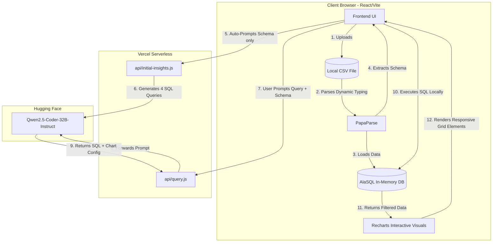

<div align="center">
  
# 🚀 CLARION: Serverless AI Analytics Dashboard

**Transform any CSV dataset into dynamic, beautiful interactive charts using natural language.**  
*Zero databases. Zero infrastructure costs. 100% Client-Side Processing.*

[](https://react.dev/)
[](https://vitejs.dev/)
[](https://tailwindcss.com/)
[](https://huggingface.co/)
[](https://vercel.com)

</div>

<br/>

## 🌟 The Problem
Data analytics tools are notoriously complex, expensive, and require significant infrastructure (SQL databases, stateful backends, auth systems). For small teams, hackathons, or individuals who just want to quickly visualize a `.csv` file, the barrier to entry is simply too high. Furthermore, sending sensitive data to third-party APIs poses security and privacy risks.

## 💡 The Solution: Clarion
Clarion completely reimagines data visualization by moving the entire data processing pipeline into the user's web browser. 

By leveraging **in-browser SQL processing** combined with **Generative AI**, Clarion allows users to upload a dataset and instantly ask questions in plain English. The AI generates the required SQL, which the browser executes locally against the uploaded data, instantly rendering beautiful, responsive charts in a clean 2x2 dashboard layout.

### ✨ Key Features
- **🗣️ Natural Language to SQL:** Ask questions like *"Show me the total sales by region and category"* and watch the magic happen.
- **⚡ Instant Auto-Insights:** The moment you upload a dataset, Clarion's AI automatically generates 4 distinct, intelligent visualizations and populates a 2x2 dashboard grid before you even type a query.
- **🔒 100% Private Data Handling:** Your `.csv` file **never** leaves your browser. Parsing and SQL execution happen entirely on the client-side.
- **⚡ Zero-Latency Analytics:** Because the database lives in browser memory, querying millions of rows happens in milliseconds.
- **📈 Dynamic Type Casting:** Automatically parses CSV text strings into pure numeric values (`dynamicTyping`), ensuring that Recharts renders math-accurate graphs.
- **🤖 Open-Source AI:** Powered by Hugging Face's free Serverless Inference API using **Qwen2.5-Coder-32B-Instruct** — no rate limits, no paid subscriptions.
- **💸 $0 Infrastructure Setup:** Designed to run seamlessly on Vercel's free tier. No persistent databases to manage or pay for.

---

## 🏗️ System Architecture

Clarion achieves its free, serverless architecture through a specific division of labor:



### The Workflow:
1. **Upload:** User uploads a `.csv` via the UI. 
2. **Offline Parsing:** `papaparse` reads the file instantly in the browser and dynamically casts types (numbers vs strings).
3. **Local Database Generation:** `alasql` spins up a virtual SQL database in the browser memory and ingests the parsed data, generating a schema mapping.
4. **Auto-Insights Generation:** Upon successful load, the UI silently pings `/api/initial-insights` with the data schema. The AI creates 4 varied, analytical SQL queries to populate the initial blank canvas.
5. **Interactive Queries:** When the user types a manual query, the frontend sends the *schema only* (no user data) and the natural language prompt to `/api/query`.
6. **Secure Execution:** The serverless functions securely hold the Hugging Face token, call **Qwen2.5-Coder-32B-Instruct** via the Hugging Face Inference API, and return the constructed SQL queries.
7. **Local Rendering:** The browser executes the SQL against `alasql` and pipes the resulting JSON into our dynamic `recharts` grid with robust fallback key mapping and automatic decimal formatting.

---

## 🛠️ Tech Stack

| Layer | Technology |
|---|---|
| **Frontend Framework** | React 19 + Vite 7 |
| **Styling** | Tailwind CSS 4 |
| **Local Database Engine** | AlaSQL (in-browser SQL) |
| **CSV Parser** | PapaParse (with dynamic typing) |
| **Data Visualization** | Recharts |
| **Icons** | Lucide React |
| **Serverless API** | Node.js (Vercel Serverless Functions) |
| **AI Model** | Qwen2.5-Coder-32B-Instruct via Hugging Face Inference API |
| **Deployment** | Vercel |

### 🎨 Design System
| Element | Value |
|---|---|
| **Background** | `#F3EFE7` — Architectural Paper Beige |
| **Cards** | `#FFFFFF` |
| **Primary Text** | `#111111` |
| **Secondary Text** | `#555555` |
| **Accent / CTA** | `#000000` |
| **Borders** | `#D9D4CB` |
| **Chart Palette** | Monochrome (Black → Grey gradient) |
| **Typography** | Inter / System Sans-Serif |

---

## 🚀 Local Development / Quick Start

### 1. Clone the Repository
```bash
git clone https://github.com/wolf1276/clarion.git
cd clarion
```

### 2. Install Dependencies
```bash
npm install
```

### 3. Setup Environment Variables
Create a `.env` file in the root directory and add your Hugging Face token:
```env
# Get your free token at: https://huggingface.co/settings/tokens
# Create a "Fine-grained" token with "Inference → Make calls to the serverless Inference API" permission
HF_TOKEN=hf_your_token_here
```

### 4. Start the Dev Servers
Because Vercel Serverless functions run differently than standard Vite apps, we need a mock server locally:
```bash
# Terminal 1: Start the mock API Server
node api-server.js

# Terminal 2: Start the Vite Frontend
npm run dev
```

Visit `http://localhost:5173` to view the application!

---

## 🌐 Deployment (Vercel)

Deploying Clarion is incredibly simple since it was designed with Vercel in mind.

1. Push your code to a GitHub repository.
2. Log into [Vercel](https://vercel.com) and click **Add New Project**.
3. Select your GitHub repository.
4. Under **Environment Variables**, add:
   - Name: `HF_TOKEN`
   - Value: `[your_hugging_face_token]`
5. Click **Deploy**. Vercel will automatically detect Vite and expose your `api/` files as serverless endpoints!

---

## 🤖 AI Model Details

Clarion uses **Qwen2.5-Coder-32B-Instruct** hosted on Hugging Face's free Serverless Inference API. This model was specifically chosen because:

- **Code-specialized:** Exceptional at generating accurate SQL queries from natural language
- **JSON-native:** Reliably outputs structured JSON without markdown contamination
- **Free & unlimited:** No rate limits or paid subscriptions required via Hugging Face
- **Open-source:** Fully transparent, auditable model weights

> **Note:** Clarion was previously powered by Google Gemini 2.5 Flash. The migration to Hugging Face was done to eliminate API rate limits (`429 Too Many Requests`) encountered on Google's free tier, providing a truly unlimited free experience.

---

<div align="center">
  <p>Built with ❤️</p>
</div>
